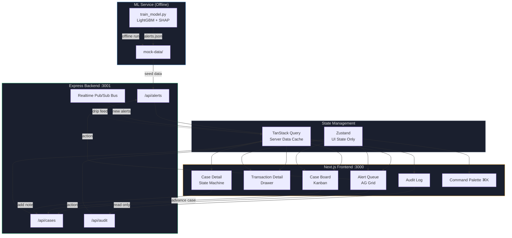
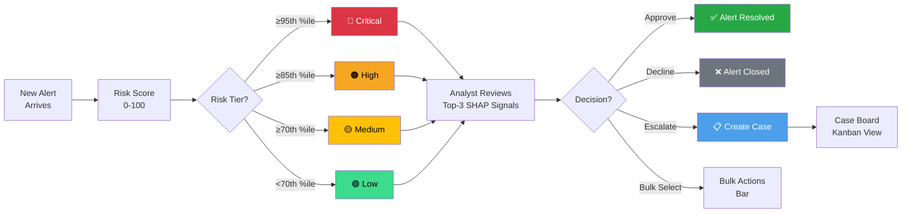
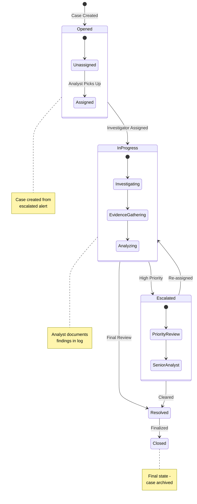
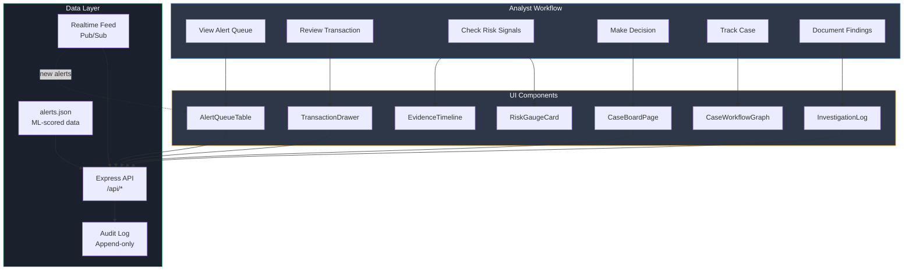
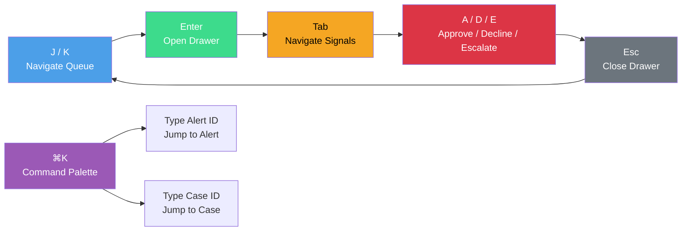

# Watch Desk — Fraud Investigation Dashboard

**Author: [Swati Keshari](https://github.com/Swati-keshari)** — personal project.

A student-readable ops desk: a payment looks odd, a person decides (let through / stop / open a case), and a diary records the click. Live risk scoring uses **LightGBM on Render**.

## Website and production links

Render already hosts **two** services from `render.yaml`. The GitHub **About → Website** field should be the first URL (the full desk, not only the model).

| | Link |
|---|---|
| **Full Watch Desk (the real website)** | https://watch-desk-web.onrender.com/ |
| Word list, alerts, cases, practice lab | Same URL — use the left-hand menu |
| **LightGBM model API** | https://watch-desk-lgbm.onrender.com/ |
| Health | https://watch-desk-lgbm.onrender.com/health |
| Score a payment (model form) | https://watch-desk-lgbm.onrender.com/score |
| This repository | https://github.com/Swati-keshari/fraud-investigation-dashboard |

The Next.js UI and the Python model are both on Render. Free apps sleep; the first open after idle can take ~30 seconds.

Vercel can host the **Next.js UI** (not LightGBM). SQLite is copied to `/tmp` there so the read-only serverless disk does not crash the app. Import the GitHub repo in Vercel as a Next.js project; do not set `output: export`. LightGBM stays on Render.

## Does the website use the model?

**Yes, live LightGBM** from `watch-desk-lgbm`:

- Full desk: **How it works** (`/`) and **Practice lab** (`/test`) on https://watch-desk-web.onrender.com/
- Model-only site: form on https://watch-desk-lgbm.onrender.com/

**Not live:** the **alert queue** still shows saved demo scores from training, not a new prediction for every row.

## GitHub contributors

This GitHub repository was recreated as a single commit so the contributor graph matches the project owner.

## Run the full UI locally

```bash
npm install
npm run dev
```

Open http://localhost:3000 — home page **Score with LightGBM** talks to production Render.

```bash
npm run dev:all   # UI + local Express on :3001 (optional)
```

Model training (offline, Python): `python3 ml-service/train_model.py`  
Render blueprint: `render.yaml`

The longer architecture notes (problem, stack, deviations from the brief) start below.

---

## What Problem Does This Project Solve?

Financial institutions and payment processors face an overwhelming volume of
fraud alerts every day — thousands of flagged transactions that analysts must
review, triage, and act on. The core problems this project addresses:

### The Business Problems

| Problem | Impact |
|---|---|
| **Alert fatigue** | Analysts drown in a flat list of alerts with no prioritization — critical fraud gets buried under low-risk noise |
| **Slow triage** | Reviewing each alert means jumping between multiple tools: transaction history, customer profile, risk scores, evidence notes |
| **No case continuity** | When an alert is escalated, context is lost — there's no single place to track an investigation from start to resolution |
| **Blind actions** | Decisions (approve / decline / escalate) happen without a clear audit trail, making compliance and post-incident review impossible |
| **No real-time awareness** | New fraud arrives constantly, but dashboards are static — analysts don't know what just hit until they refresh |
| **Scaling analyst throughput** | As transaction volumes grow, the only way to keep up is to throw more bodies at it — there's no tooling to make each analyst faster |

### The Technical Problems

| Problem | Why It's Hard |
|---|---|
| **Risk scoring at scale** | Rules-based systems produce too many false positives; ML models need explainability to be trusted by analysts |
| **Real-time data flow** | Static dashboards can't keep up with live fraud feeds without complex WebSocket infrastructure |
| **State machine workflows** | Investigations follow a defined process (opened → in progress → escalated → resolved → closed), but most tools don't enforce or visualize that flow |
| **Responsive operations UI** | Dashboards that look great on a 27" monitor break on a tablet on an ops floor — and analysts use both |
| **Keyboard-first productivity** | Power users need to triage fast without touching the mouse — most dashboards don't support this |

---

## How This Project Solves Those Problems

### 1. ML-Powered Risk Prioritization (Solves: Alert Fatigue, Blind Actions)

**The problem:** Not all alerts are equal. A $5 transfer to a known payee is
noise; a $5,000 transfer to a new account at 3 AM is a crisis. Analysts waste
hours reviewing low-risk alerts while high-risk ones sit in the queue.

**How it's solved:**

- **LightGBM classifier** (`ml-service/train_model.py`) trains on the PaySim
  synthetic dataset, learning what "normal" transactions look like with
  class-imbalance handling via `scale_pos_weight`
- Each alert gets a **risk score (0–100)** and is assigned a **risk tier**
  (critical / high / medium / low) based on percentile cutoffs
- The model computes **top-3 contributing signals** per alert via SHAP — not
  opaque scores, but human-readable explanations like "Transaction amount
  increases risk" or "Nighttime transaction increases risk"
- The alert queue is **sorted by risk tier then score** — critical alerts are
  always at the top, never buried
- PR-AUC and precision@k metrics validate model quality before alerts reach
  the dashboard

**Key files:**
- `ml-service/train_model.py` — Model training, feature engineering, SHAP explanations
- `src/lib/riskScoring.ts` — Client-side risk display logic
- `src/components/alerts/RiskGaugeCard.tsx` — Visual risk gauge with SVG arc

---

### 2. Unified Alert Queue with Instant Triage (Solves: Slow Triage, Scaling Throughput)

**The problem:** Reviewing an alert requires transaction details, customer
history, risk signals, and evidence — spread across multiple screens. Each
context switch costs 30–60 seconds of analyst time.

**How it's solved:**

- **AG Grid virtualized table** handles thousands of alerts without pagination
  lag — sortable by risk tier, filterable by tier and search, with checkbox
  multi-select for bulk operations
- **Transaction detail drawer** opens inline (native `<dialog>` with free
  focus-trap) showing:
  - Risk gauge (SVG arc with the ML score)
  - Top-3 signal cards (why this alert was flagged)
  - Evidence timeline (anomaly detection, velocity checks, customer history)
- **Keyboard-first triage:** `A` approve, `D` decline, `E` escalate,
  `J`/`K` next/previous — analysts can clear 100 alerts without touching
  the mouse
- **Optimistic actions** — approve/decline/escalate update the row instantly;
  if the simulated API rejects (~6% of actions, on purpose), the change
  rolls back with a toast notification
- **Bulk actions bar** — select multiple alerts, approve/decline/escalate in
  one click

**Key files:**
- `src/components/alerts/AlertQueueTable.tsx` — AG Grid integration
- `src/components/alerts/TransactionDetailDrawer.tsx` — Detail drawer
- `src/components/alerts/EvidenceTimeline.tsx` — Evidence display
- `src/components/common/BulkActionsBar.tsx` — Bulk action UI

---

### 3. Case Management with Visual State Machine (Solves: No Case Continuity)

**The problem:** When an alert is escalated, it becomes a case — but most
tools lose the connection. The analyst who picks up the case doesn't know
what the original triager found, and there's no enforced workflow.

**How it's solved:**

- **Kanban case board** (`src/components/cases/CaseBoardPage.tsx`) organizes
  cases by status: Opened → In Progress → Escalated → Resolved → Closed
- **Interactive state-machine diagram** (`@xyflow/react`) visualizes the
  workflow — the current state is highlighted, and the **next valid state is
  clickable** to advance the case (enforcing the workflow, not just documenting it)
- **Investigation log** with debounced autosave (React Hook Form + Zod) —
  analysts document findings in context, right on the case page
- **Case detail page** links back to the original alert, preserving the full
  investigation trail

**Key files:**
- `src/components/cases/CaseBoardPage.tsx` — Kanban board
- `src/components/cases/CaseDetailPage.tsx` — Case detail view
- `src/components/cases/CaseWorkflowGraph.tsx` — Interactive state machine
- `src/components/cases/InvestigationLog.tsx` — Autosave investigation notes

---

### 4. Append-Only Audit Log (Solves: Blind Actions)

**The problem:** Regulators and compliance teams need to know who did what,
when, and why. Without an audit trail, post-incident reviews are impossible.

**How it's solved:**

- Every action (approve / decline / escalate / create case / case status
  change / note added) is logged to an **append-only audit log**
- The audit panel is **filterable by action type** — compliance can quickly
  find all escalations, all bulk actions, or all case status changes
- Each entry includes: actor, action type, target (alert or case), detail,
  and timestamp
- The log is **read-only** — no delete, no edit, no tampering

**Key files:**
- `src/lib/auditLogger.ts` — Audit log writer
- `src/components/common/AuditLogPanel.tsx` — Audit log display
- `src/app/(dashboard)/audit/page.tsx` — Full audit log page

---

### 5. Real-Time Alert Feed (Solves: No Real-Time Awareness)

**The problem:** Fraud doesn't wait for a dashboard refresh. New high-risk
transactions arrive every second, and analysts need to know immediately.

**How it's solved:**

- **Custom pub/sub bus** (`src/lib/mockApi.ts`) simulates a real-time fraud
  feed — new alerts drip in on an interval and merge directly into the
  TanStack Query cache
- **Live badge counter** shows how many new alerts have arrived since the
  last review
- **`aria-live` announcer** notifies screen readers of new alerts (accessibility)
- The same contract (`subscribeToNewAlerts(listener)`) works with any
  backend — swap in Socket.io or MSW `ws` handlers by changing one file

**Key files:**
- `src/hooks/useRealtimeAlerts.ts` — Real-time subscription hook
- `src/lib/mockApi.ts` — Pub/sub bus and mock API
- `src/components/alerts/AlertQueuePage.tsx` — Live badge and announcer

---

### 6. Responsive Operations UI (Solves: Responsive Operations UI)

**The problem:** Analysts work on 27" monitors at their desk AND on tablets
during floor walks. Most dashboards break on smaller screens.

**How it's solved:**

- **AG Grid → stacked cards** below `sm` breakpoint — the same data in a
  different layout
- **Container queries** (`@container` / `@sm:`) so the card layout works
  correctly in split views, not just at the viewport level
- **Filter bar → sheet** on mobile
- **Server Component nav/layout shell** for instant page loads
- **`next/font`** for zero CLS, **`content-visibility: auto`** on evidence
  sections for rendering performance

---

### 7. Accessibility by Design (Solves: Keyboard-First Productivity)

**The problem:** Power users need speed; accessibility requirements demand
screen reader support. Most dashboards sacrifice one for the other.

**How it's solved:**

- **Full keyboard path:** Queue → `J`/`K` to navigate → `Enter` to open
  drawer → `A`/`D`/`E` to decide — no mouse required
- **`⌘K` command palette** for quick navigation to alerts or cases
- **Risk level always paired with text** — color is never the only signal
  (critical = red + "Critical" label)
- **Visible focus rings** on all interactive elements
- **Native `<dialog>`** for the detail drawer — free focus-trap and `Esc` to
  close, no custom library needed

---

## System Flow Diagram



## Alert Triage Flow



## Case Workflow State Machine



## Data Flow Architecture



## Keyboard Navigation Flow



**State boundary:** TanStack Query owns server data (alerts, cases, audit log).
Zustand only owns pure UI/session state (drawer open, bulk selection, filter
drafts). Server data is never duplicated into Zustand.

---

## Quick Start

```bash
npm install
npm run dev             # http://localhost:3000
```

The Express backend runs on port 3001. The mock data is pre-generated in
`mock-data/alerts.json`.

**Optional — regenerate mock data:**
```bash
pip install -r ml-service/requirements.txt
npm run gen:mock-data
```

Requires Node 18.18+ and Python 3.9+.

---

## What's Actually Implemented

- **Alert queue** — AG Grid, virtualized, sortable by risk tier then score,
  filterable by tier and search, checkbox multi-select, new-row animation
- **Realtime feed** — new alerts drip in on an interval and merge straight
  into the TanStack Query cache; live badge counter; `aria-live` announcer
- **Transaction detail drawer** — native `<dialog>` (free focus-trap + Esc),
  risk gauge (SVG arc, scikit-learn score), top-3 signal cards, evidence
  timeline (anomaly / velocity / customer history)
- **Optimistic actions** — Approve / Decline / Escalate / Create Case update
  the row instantly, roll back with a toast on simulated API rejection
  (~6% of actions, on purpose, so you can see the rollback path)
- **Keyboard-first triage** — `A` approve, `D` decline, `E` escalate,
  `J`/`K` next/previous alert, `⌘K` command palette
- **Bulk actions bar** — slides up on multi-select
- **Case board** — Kanban by status, **case detail** with a live,
  interactive `@xyflow/react` state-machine diagram (click the highlighted
  next node to advance the case) and an investigation log with
  debounced autosave (React Hook Form + Zod)
- **Audit log** — append-only, filterable by action type
- **Responsive** — AG Grid → stacked cards below `sm`, filter bar → sheet,
  the card row itself uses a real container query (`@container`/`@sm:`) so
  it lays out correctly even when squeezed into a split view, not just at
  the viewport level
- **Performance** — Server Component nav/layout shell, AG Grid and React
  Flow behind `next/dynamic`, `next/font` (zero CLS), `content-visibility:
  auto` on evidence sections, debounced filter input, predictive
  `prefetchQuery` on row hover
- **A11y** — risk level always paired with text (never color-only), visible
  focus rings, full keyboard path queue → drawer → decision

---

## Where This Deviates from the Brief — and Why

The brief's tech choices were sound as written; three of them had shifted
under our feet by the time this was actually built, and shipping them
as-specified would have meant either a broken build or a security hole.
Fixing forward seemed better than a portfolio piece that doesn't run.

| Brief said | This uses | Why |
|---|---|---|
| `reactflow` | `@xyflow/react` | Same team, same API shape — `reactflow` v11 is the frozen predecessor; `@xyflow/react` is where development actually continues. |
| AG Grid (unpinned) | `ag-grid-community`/`ag-grid-react` v36, `theme="legacy"` | v33+ replaced CSS-class themes with a JS Theming API. `theme="legacy"` is AG Grid's own documented compatibility flag, which let this keep the CSS-variable theme in `globals.css` (`.ag-theme-fraud`) instead of a rewrite. |
| `@cloudflare/next-on-pages` for deploy | `@opennextjs/cloudflare` | `next-on-pages` is deprecated (Cloudflare says so in the package itself) and caps at `next@15.5.2` — which has a critical, unauthenticated RCE (CVE-2025-66478, CVSS 10.0). OpenNext supports patched Next versions and is what's carrying new development. Confirmed end-to-end in this sandbox: `npm run cf:build` produces a real `.open-next/worker.js`. |
| `next` (unpinned) | `15.5.25` | The exact patched build for the CVE above, and within OpenNext's supported range. |
| Socket.io / MSW mocked WebSocket | Custom pub/sub bus (`lib/mockApi.ts`) | Same contract a real socket would give a consumer (`subscribeToNewAlerts(listener)`), zero service-worker registration to keep alive for a demo this size. Swapping in real MSW `ws` handlers or a Socket.io server later is a change to that one file — nothing above it (hooks, components) needs to know. |

Worth knowing about, not blocking: `npm audit` reports 1 high, 1 moderate
finding, both transitive `postcss` issues pulled in by Next's own bundled
build tooling (not runtime-exposed). The clean fix is Next 16, which is a
major-version jump I didn't want to force through untested against AG
Grid/React Flow/RHF for a stability-first deliverable — upgrade at your
discretion.

---

## What's Intentionally Thin

This is a full, running app, not a mockup — every screen renders and every
action does something real against the mock backend. But at this scope,
some of the brief's bullets got the "make it work" pass, not the "make it
exhaustive" pass:

- **Saved filters** persist for the session (Zustand) but aren't written
  back to storage — refresh and they reset to the two seeded defaults.
- **Command palette** jumps to alerts/cases; it doesn't yet do actions
  ("approve ALT-1234" as a typed command).
- **Bulk actions** cover approve/decline/escalate; there's no bulk case
  creation or bulk export.
- The **evidence timeline** reasons from the same feature vector the risk
  model used — it's a real explanation, not a separately-sourced dataset.
- **Tests**: none yet. Phase 6 in the original brief (WebSocket
  disconnect/reconnect under load, high-volume burst handling) is the
  next thing to build, not something already covered.

---

## Deploying to Cloudflare

```bash
npm run cf:build     # opennextjs-cloudflare build -> .open-next/worker.js
npm run cf:preview   # build + local Workers-runtime preview
npm run cf:deploy    # build + wrangler deploy (needs `wrangler login` first)
```

`wrangler.jsonc` is already wired for the OpenNext output
(`main: ".open-next/worker.js"`, assets binding, `nodejs_compat`). If
you add D1/KV bindings later, uncomment the relevant block in `wrangler.jsonc`
and put the real IDs in — a Cloudflare connector can provision the actual
D1 database / KV namespace on your account if you want that; it wasn't
done automatically here since that mutates your live account and needs
your go-ahead first.

**Heads up on `vinext`:** Cloudflare has a newer, framework-native path
(`vinext`) that's positioned as the eventual default, but as of this
writing it's explicitly experimental and targets Next.js 16 only. Given
this app leans on AG Grid, React Flow, and RHF+Zod — none of which have
been vetted against that stack yet — OpenNext is the safer choice today.
Worth revisiting once `vinext` and Next 16 both stabilize.

---

## Design

Graphite/cool-slate console, not a marketing-dashboard palette — this is
built for an analyst staring at it all shift, on a monitor or a tablet on
an ops floor. IBM Plex Mono for anything that's data (IDs, amounts,
timestamps); IBM Plex Sans for UI chrome and prose. Risk-tier colors
(critical/high red, medium amber, low green, info blue) always ship with a
text label alongside — color is never the only signal.
